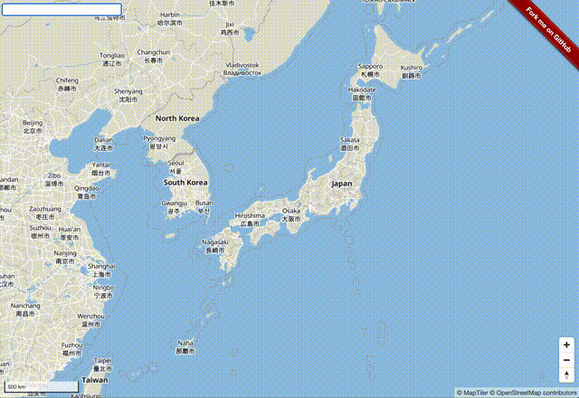

# Maptiler Geocoder

MapTilerのジオコーダー([maptiler/geocoder](https://github.com/maptiler/geocoder))をMapbox GL JSで使用するサンプルです。



## ライブラリの使い方

- HTMLに検索ボックス用のdivを追加します
```html
  <div class="overlay">
    <input autocomplete="off" id="search" type="text" />
  </div>
```

- 検索ボックスが地図上に重なるようにCSSを追加します
```html
  <style>
    .overlay {
        width: 200px;
        position: absolute;
        top: 5;
        left: 5;
        margin: 5px;
        z-index: 90;
        background-color: rgba(255, 255, 255, 0.8);
    }
  </style>
```

- ジオコーダーのスクリプトを以下のように書きます。
```js
import { Geocoder } from '@maptiler/geocoder';
import '@maptiler/geocoder/css/geocoder.css';

const geocoder = new Geocoder({
    input: 'search', // divのIDを指定する
    key: {Your access key} // Maptiler Cloudで取得したキーを指定する
});

let marker;

// ジオコーディング後の選択した地物が以下のイベントで取得できるので、
// ズームして、中心にマーカーを置くようにします。
geocoder.on('select', function(item) {
    map.fitBounds(item.bbox);
    if (marker) marker.remove();
    marker = new mapboxgl.Marker()
    .setLngLat(item.center)
    .addTo(map);
});
```

## インストール方法

- リポジトリのダウンロード
```zsh
git clone git@github.com:MIERUNE/maptiler-sample.git
cd maptiler-sample/geocoding
```

- パッケージのインストール
```
yarn

or 

npm i
```

## MapTilerのキーの取得

[MapTiler Cloud](https://cloud.maptiler.com/)からあらかじめアクセストークンを取得しておきます。

```zsh
cp .env.example .env
vi .env
# アクセス用のキーを.envに指定します。
MAPTILER_KEY={Your access key}
```

## 開発用サーバーで起動

```
yarn run dev

or

npm run dev
```

## ビルド

```
yarn run build

or

npm run build
```

## ライセンス

本ソースコードはMITライセンスです。