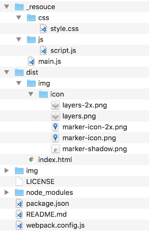
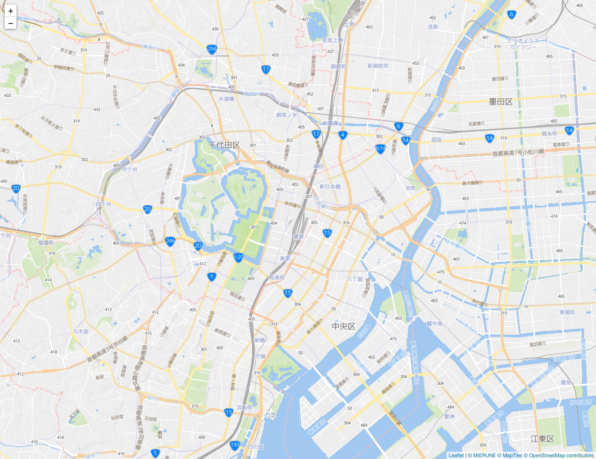

# Leaflet x MapTiler Raster Tiles


Start Leaflet easily.  
- [Leaflet v1.7.1](http://leafletjs.com) 
- [webpack v5.11.1](https://webpack.js.org)  
- node v15.5.0
- npm v7.3.0

<br>

## Usage



<br>

Install package
```bash
npm install
```

<br>

build
```bash
npm run build
```

<br>

dev
```bash
npm run dev
```

<br>

## Example

<br>

./_resouce/js

script.js
```javascript
// デフォルトアイコンパス
L.Icon.Default.imagePath = './img/icon/';

// MIERUNE Streets読み込み
const m_streets = new L.tileLayer(
    'https://api.maptiler.com/maps/jp-mierune-streets/256/{z}/{x}/{y}.png?key=[APIキー]',
    {
        attribution:
            '<a href="https://maptiler.jp/" target="_blank">© MIERUNE</a> <a href="https://www.maptiler.com/copyright/" target="_blank">© MapTiler</a> <a href="https://www.openstreetmap.org/copyright" target="_blank">© OpenStreetMap contributors</a>',
    }
);

// MAP読み込み
const map = L.map('map', {
    center: [35.681, 139.767],
    zoom: 14,
    zoomControl: true,
    layers: [m_streets],
});
```

<br>
<br>



<br>

## License
MIT

Copyright (c) 2021 MIERUNE Inc.

<br>

---

<br>

### Japanese

<br>

# Leaflet x MapTiler ラスタタイル


Leafletを手軽に始める
- [Leaflet v1.7.1](http://leafletjs.com) 
- [webpack v5.11.1](https://webpack.js.org)  
- node v15.5.0
- npm v7.3.0

<br>

##  使用方法


<br>

パッケージインストール

```bash
npm install
```

<br>

ビルド

```bash
npm run build
```

<br>

開発

```bash
npm run dev
```

<br>

## 例

<br>

./_resouce/js

script.js
```javascript
// デフォルトアイコンパス
L.Icon.Default.imagePath = './img/icon/';

// MIERUNE Streets読み込み
const m_streets = new L.tileLayer(
    'https://api.maptiler.com/maps/jp-mierune-streets/256/{z}/{x}/{y}.png?key=[APIキー]',
    {
        attribution:
            '<a href="https://maptiler.jp/" target="_blank">© MIERUNE</a> <a href="https://www.maptiler.com/copyright/" target="_blank">© MapTiler</a> <a href="https://www.openstreetmap.org/copyright" target="_blank">© OpenStreetMap contributors</a>',
    }
);

// MAP読み込み
const map = L.map('map', {
    center: [35.681, 139.767],
    zoom: 14,
    zoomControl: true,
    layers: [m_streets],
});
```

<br>
<br>


<br>

## ライセンス
MIT

Copyright (c) 2021 MIERUNE Inc.

<br>
