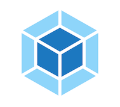
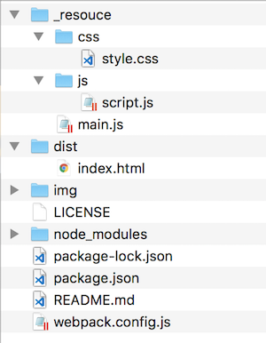
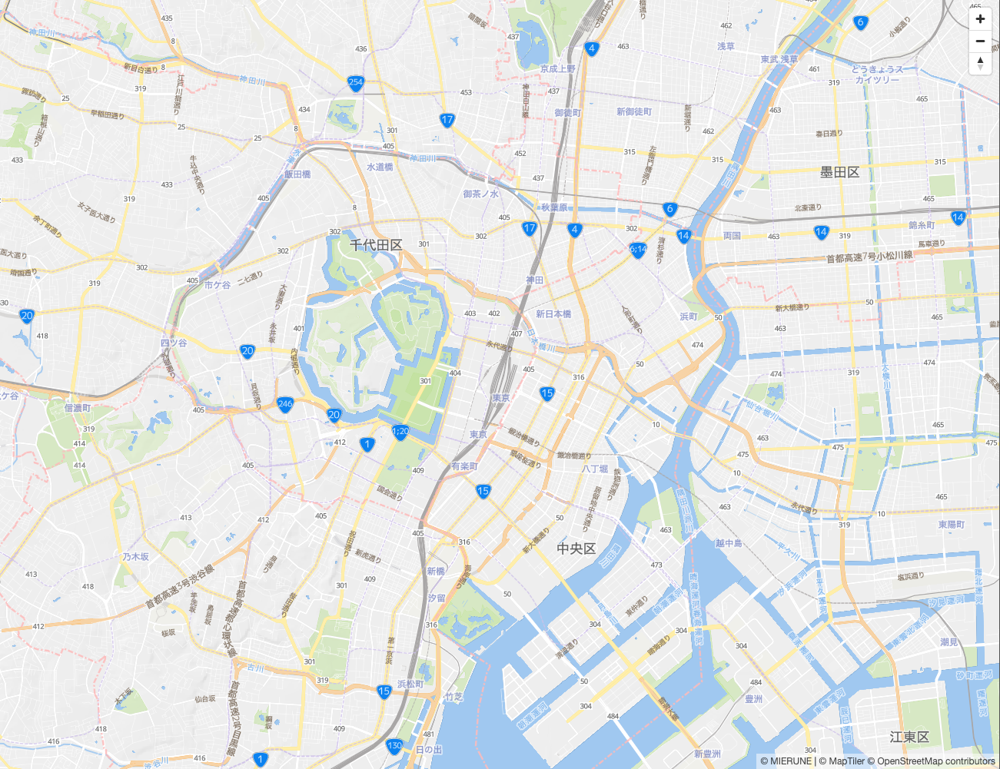

# Mapbox GL JS v1 x MapTiler Vector Tiles




Start MapboxGLJS easily.  
- [MapboxGLJS v1.13.0](https://www.mapbox.com/mapbox-gl-js/api) 
- [webpack v5.11.1](https://webpack.js.org)  
- node v15.5.0
- npm v7.3.0

<br>

## Usage



<br>

Install package
```bash
npm install
```

<br>

build
```bash
npm run build
```

<br>

dev
```bash
npm run dev
```

<br>

## Example

<br>

./_resouce/js

script.js
```javascript
// MIERUNE Streets読み込み
const map = new mapboxgl.Map({
    container: 'map',
    style: 'https://api.maptiler.com/maps/jp-mierune-streets/style.json?key=[APIキー]',
    center: [139.767, 35.681],
    zoom: 13,
});

// コントロール関係表示
map.addControl(
    new mapboxgl.NavigationControl({
        visualizePitch: true,
    })
);
```

<br>
<br>



<br>

## License
MIT

Copyright (c) 2021 MIERUNE Inc.

<br>

---

<br>

### Japanese

<br>

# Mapbox GL JS v1 x MapTiler ベクトルタイル


MapboxGLJSを手軽に始める
- [MapboxGLJS v1.13.0](https://www.mapbox.com/mapbox-gl-js/api) 
- [webpack v5.11.1](https://webpack.js.org)  
- node v15.5.0
- npm v7.3.0

<br>

##  使用方法


<br>

パッケージインストール

```bash
npm install
```

<br>

ビルド

```bash
npm run build
```

<br>

開発

```bash
npm run dev
```

<br>

## 例

<br>

./_resouce/js

script.js
```javascript
// MIERUNE Streets読み込み
const map = new mapboxgl.Map({
    container: 'map',
    style: 'https://api.maptiler.com/maps/jp-mierune-streets/style.json?key=[APIキー]',
    center: [139.767, 35.681],
    zoom: 13,
});

// コントロール関係表示
map.addControl(
    new mapboxgl.NavigationControl({
        visualizePitch: true,
    })
);
```

<br>
<br>


<br>

## ライセンス
MIT

Copyright (c) 2021 MIERUNE Inc.

<br>
