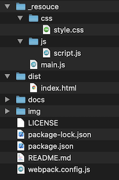
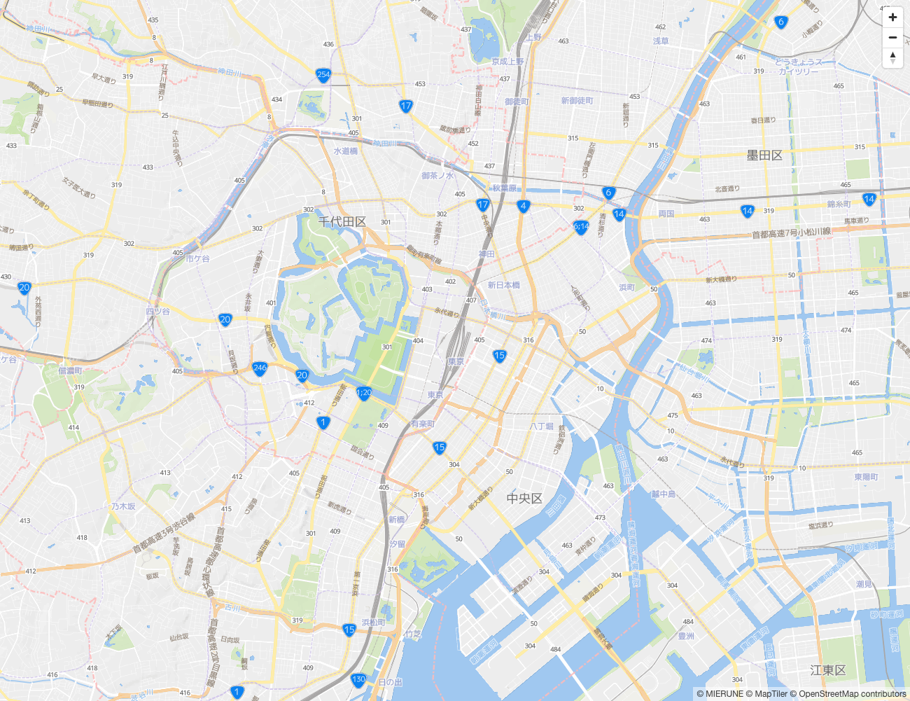

# MapLibre GL JS x MapTiler Raster Tiles


Start MapLibre GL JS easily.  
- [MapLibre GL JS v1.14.0](https://github.com/maplibre/maplibre-gl-js) 
- [webpack v5.11.1](https://webpack.js.org)  
- node v15.5.0
- npm v7.3.0

<br>

## Usage



<br>

Install package
```bash
npm install
```

<br>

build
```bash
npm run build
```

<br>

dev
```bash
npm run dev
```

<br>

## Example

<br>

./_resouce/js

script.js
```javascript
// MIERUNE Streets読み込み
const map = new maplibregl.Map({
    container: 'map',
    style: {
        version: 8,
        sources: {
            m_streets: {
                type: 'raster',
                tiles: [
                    'https://api.maptiler.com/maps/jp-mierune-streets/256/{z}/{x}/{y}.png?key=[APIキー]',
                ],
                tileSize: 256,
                attribution:
                    '<a href="https://maptiler.jp/" target="_blank">© MIERUNE</a> <a href="https://www.maptiler.com/copyright/" target="_blank">© MapTiler</a> <a href="https://www.openstreetmap.org/copyright" target="_blank">© OpenStreetMap contributors</a>',
            },
        },
        layers: [
            {
                id: 'mierunemap',
                type: 'raster',
                source: 'm_streets',
                minzoom: 0,
                maxzoom: 18,
            },
        ],
    },
    center: [139.767, 35.681],
    zoom: 13,
});

map.addControl(
    new maplibregl.NavigationControl({
        visualizePitch: true,
    })
);
```

<br>
<br>



<br>

## License
MIT

Copyright (c) 2021 MIERUNE Inc.

<br>

---

<br>

### Japanese

<br>

# MapLibre GL JS x MapTiler ラスタタイル


MapLibre GL JSを手軽に始める
- [MapLibre GL JS v1.14.0](https://github.com/maplibre/maplibre-gl-js) 
- [webpack v5.11.1](https://webpack.js.org)  
- node v15.5.0
- npm v7.3.0

<br>

##  使用方法


<br>

パッケージインストール

```bash
npm install
```

<br>

ビルド

```bash
npm run build
```

<br>

開発

```bash
npm run dev
```

<br>

## 例

<br>

./_resouce/js

script.js
```javascript
// MIERUNE Streets読み込み
const map = new maplibregl.Map({
    container: 'map',
    style: {
        version: 8,
        sources: {
            m_streets: {
                type: 'raster',
                tiles: [
                    'https://api.maptiler.com/maps/jp-mierune-streets/256/{z}/{x}/{y}.png?key=[APIキー]',
                ],
                tileSize: 256,
                attribution:
                    '<a href="https://maptiler.jp/" target="_blank">© MIERUNE</a> <a href="https://www.maptiler.com/copyright/" target="_blank">© MapTiler</a> <a href="https://www.openstreetmap.org/copyright" target="_blank">© OpenStreetMap contributors</a>',
            },
        },
        layers: [
            {
                id: 'mierunemap',
                type: 'raster',
                source: 'm_streets',
                minzoom: 0,
                maxzoom: 18,
            },
        ],
    },
    center: [139.767, 35.681],
    zoom: 13,
});

map.addControl(
    new maplibregl.NavigationControl({
        visualizePitch: true,
    })
);
```

<br>
<br>


<br>

## ライセンス
MIT

Copyright (c) 2021 MIERUNE Inc.

<br>
