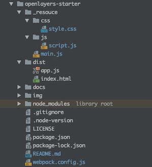

# OpenLayers x MapTiler Vector Tiles


Start OpenLayers easily.  
- [OpenLayers v6.5.0](https://openlayers.org) 
- [webpack v5.11.1](https://webpack.js.org)  
- node v15.5.0
- npm v7.3.0

<br>

## Usage



<br>

Install package
```bash
npm install
```

<br>

build
```bash
npm run build
```

<br>

dev
```bash
npm run dev
```

<br>

## Example

<br>

./_resouce/js

script.js
```javascript
import Map from 'ol/Map';
import View from 'ol/View';
import { fromLonLat } from 'ol/proj';
import olms from 'ol-mapbox-style';

// MIERUNE Streets読み込み
const styleJson =
    'https://api.maptiler.com/maps/jp-mierune-streets/style.json?key=[APIキー]';
const map = new Map({
    target: 'map',
    view: new View({
        center: fromLonLat([139.767, 35.681]),
        zoom: 14,
    }),
});
olms(map, styleJson);
```

<br>
<br>


<br>

## License
MIT

Copyright (c) 2021 MIERUNE Inc.

<br>

---

<br>

### Japanese

<br>

# OpenLayers x MapTiler ベクトルタイル


OpenLayersを手軽に始める
- [OpenLayers v6.5.0](https://openlayers.org) 
- [webpack v5.11.1](https://webpack.js.org)  
- node v15.5.0
- npm v7.3.0

<br>

##  使用方法


<br>

パッケージインストール

```bash
npm install
```

<br>

ビルド

```bash
npm run build
```

<br>

開発

```bash
npm run dev
```

<br>

## 例

<br>

./_resouce/js

script.js
```javascript
import Map from 'ol/Map';
import View from 'ol/View';
import { fromLonLat } from 'ol/proj';
import olms from 'ol-mapbox-style';

// MIERUNE Streets読み込み
const styleJson =
    'https://api.maptiler.com/maps/jp-mierune-streets/style.json?key=[APIキー]';
const map = new Map({
    target: 'map',
    view: new View({
        center: fromLonLat([139.767, 35.681]),
        zoom: 14,
    }),
});
olms(map, styleJson);
```

<br>
<br>


<br>

## ライセンス
MIT

Copyright (c) 2021 MIERUNE Inc.

<br>
